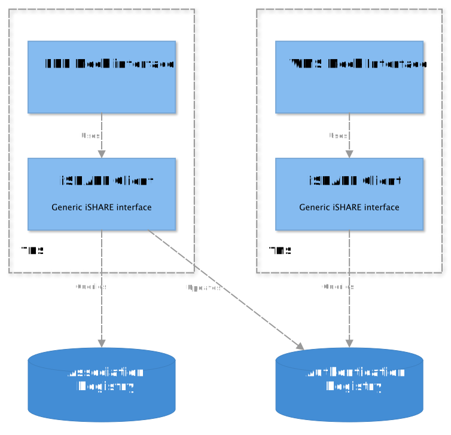
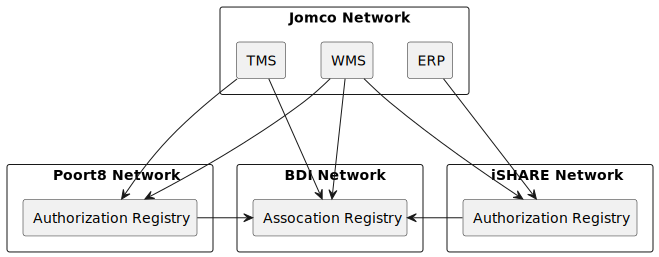
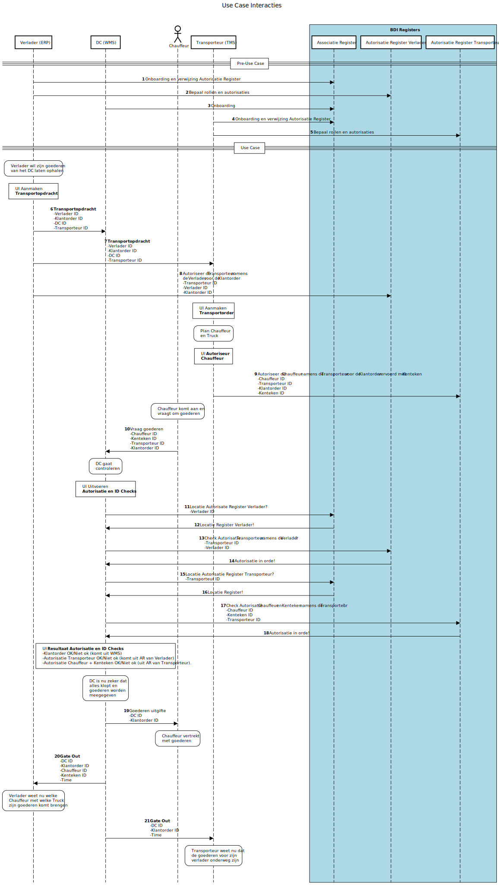

<!--
SPDX-FileCopyrightText: 2024 Jomco B.V.
SPDX-FileCopyrightText: 2024 Topsector Logistiek
SPDX-FileContributor: Joost Diepenmaat <joost@jomco.nl>
SPDX-FileContributor: Remco van 't Veer <remco@jomco.nl>

SPDX-License-Identifier: AGPL-3.0-or-later
-->

---
title: Architectuuromschrijving Vertrouwde Goederenuitgifte Demo
author: Joost Diepenmaat <joost@jomco.nl>
language: nl
---

Dit document beschrijft de software architectuur van de "Vertrouwde
Goederenuitgifte Demo". Functioneel toont deze demo een autorisatie
workflow tussen meerdere partijen, gebaseerd op het iSHARE protocol.

# Toepassing

Bij de Vertrouwde goederenafgifte wisselen verladers, transporteurs en
distributiecentra alle gegevens digitaal met elkaar uit. Elke
betrokken organisatie en persoon beschikt over een geverifieerde,
digitale identiteit. Daarmee kan data rechtstreeks vanuit het eigen
systeem beschikbaar worden gesteld aan gemachtigde ketenpartners.

# Overzicht

# Generieke componenten

Bij de demo is zoveel mogelijk gebruik gemaakt van al bestaande
iSHARE-compatible services:

- iSHARE Satellite voor DIL Association Registry
- iSHARE PoC Authorisation Registry voor Transporteur AR
- Poort8 Authorization Registry voor Warehouse AR

# Mock applicaties

In de demo zijn een Tranport Management System (TMS), een Warehouse
Management System (WMS), en een Enterprise Resource Planning (ERP)
systeem geïmplementeert. Deze applicaties bootsen bestaande
bedrijfs-specifieke systemen na, inclusief al bestaande koppelingen
voor opdracht uitwisseling tussen directe relaties.

In de demo code zijn dit minimale applicaties met een gedeelde
database waarmee onderlinge opdracht-uitwisseling wordt nagebootst.

# iSHARE client

De mock applicaties gebruiken een iSHARE client die de generieke
iSHARE componenten aanspreekt om data het het Assocation Registry op
te vragen, en om autorisaties aan te maken en op te vragen uit de
verschillende Authentication Registries.

# Deployment

De verschillende componenten zijn onafhankelijk van elkaar te beheren,
door verschillende organisaties in hun eigen netwerk. Voor de demo
zijn dit:

- Jomco: ontwikkelaars van de demo
- Poort8: ontwikkelaars van een Association Registry
- iSHARE: als beheerder van een PoC Association Registry
- BDI: als beheerder van de BDI dataspace

# Use case sequence diagram

